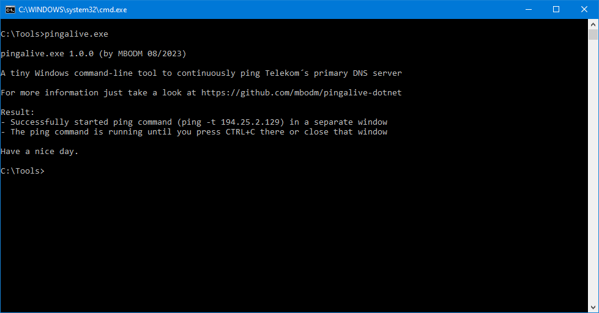

# pingalive-dotnet
A tiny Windows command-line tool to continuously ping Telekom´s primary DNS server

### What it is
- It´s a very tiny (~100 lines of code) .NET command-line executable for Windows.
- When executed, it continuously pings a specific server, until closed.
- It´s used for internet connection testing, for my personal use.

### How it works
- It just executes the Windows `ping` command with `-t 194.25.2.129` as parameters.
- The IP address (`194.25.2.129`) is Telekom´s* primary DNS server.
- The `ping` process is running standalone, in a separate window.

*Telekom is the largest ISP company in Germany. Their primary DNS server is a rather stable and longliving server (since nearly 30 years now). The IP address of that server has never changed (and will never, in my opinion). Therefore i´m using this specific IP address.

### Why it exists
I wasn´t able to successfully add a batch file (`.bat`) or a link (`.lnk`) to the Windows 10 Taskbar. At least not in a way it works properly (maybe i´m just too stupid, but all tries had some issues). So i decided to quickly write a tiny executable doing that job instead. Then i was able to add that executable to the Taskbar, without any problems. That´s the sole reason why this tool exists. :grin:

### Requirements
- Windows 11 or Windows 10 ("_May 2019 Update_" or later)
- Or any Windows (7/8/10) with an installed .NET Framework 4.8 runtime

There aren´t any other special requirements. The tool is written as .NET Framework 4.8 application and the .NET Framework 4.8 exists on any Windows (by default, as a system component), since _Windows 10 May 2019 Update_ was released. If you want to run the application with an even earlier Windows version, you just need to install the .NET Framework 4.8 runtime there.

### Earlier versions
There also exists a Rust version and a Go (golang) version of this tool. Those versions are exactly the same tool as this one, just written in Rust or Go. They were written in the past. And for the sake of _[insert some weird reason here]_ i just quickly rewrote that rather tiny application in C#/.NET now.
- For the Rust version have a look at [pingalive](https://github.com/mbodm/pingalive)
- For the Go version have a look at [pingalive-go](https://github.com/mbodm/pingalive-go)

### Notes
- The tool is written in C# 7.3 with .NET Framework 4.8 (reason: see section above)
- Release binaries are published as `win7-x86` (the only possible one in .NET 4.8)
- The tool is developed on a 64-bit Windows 10 machine
- Used Windows OS version is _Windows 10 Pro 22H2 Build 19045.3208_
- The tool is developed with _Visual Studio 2022 Version 17.6.5 (Community Edition)_
- And sadly i *again* forgot what Sean Connery teached us: "_One ping only!_"

### Dev-Aspects #1 - Why this version exists
Someone may ask

> _When writing/rewriting a C#/.NET application in 2023, why not using .NET 6 or .NET 7 and C# 10.0 then?_

The reason why i target the old .NET Framework 4.8 is simple: It´s pre-installed on any Windows version, since mid 2019. When i´m using the modern .NET versions, like .NET Core, or .NET 5/6/7 (and i often do so), i have 2 concerns to deal with:
- Since the newer .NET versions are not pre-installed on Windows, i always have to release 2 versions: A _framework-dependent_ version and a _self-contained_ version.
- Later one has a size of ~14 MB (since the framework is compiled into it). Which is, for my taste, way too huge for a simple command-line executable.
Since this application does nothing else than starting a process, there is more benefit in a ~7 KB sized executable (and just a single deployment), than in having all the tasty new features i don´t use in this application. And for the same reason i not increased the C# language version in the project, from 7.3 to 10.0 (even when this is very easy and works quite well). I just don´t need it.

### Dev-Aspects #2 - Used .NET project format

### Dev-Aspects #3 - Source code compilation
If you want to customize and build the application on your own, just follow these steps:
- Make sure Visual Studio 2022 (any edition) is installed with selected "_.NET desktop development_" workload
- Or make sure you have at least "_.NET Framework 4.8 SDK_" installed if you are not using Visual Studio
- Clone or download source code into some folder (in example `C:\Projects`)
- Open a Command Prompt or PowerShell window
- Navigate to folder where `PingAlive.csproj` file is located (in example `cd C:\Projects\pingalive-dotnet\src\PingAlive`)
- Run following command: `dotnet publish -c Release PingAlive.csproj`
- Now you can find the release binary in"_bin\Release\net48\publish_" folder

#### Have fun.
